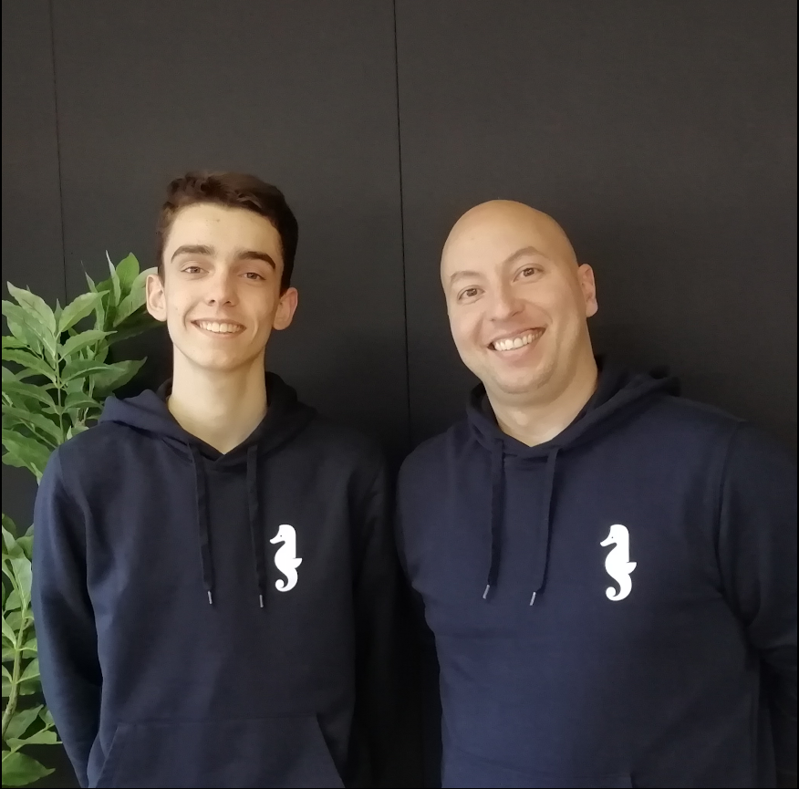

## Background Context

This is a team project. We have create a Simple shell !

Our team - Rémi and Julien - respectively - :



## Learning Objectives

At the end of this project, we are expected to be able to explain to anyone, without the help of Google:
#### General

    Who designed and implemented the original Unix operating system
    Who wrote the first version of the UNIX shell
    Who invented the B programming language (the direct predecessor to the C programming language)
    Who is Ken Thompson
    How does a shell work
    What is a pid and a ppid
    How to manipulate the environment of the current process
    What is the difference between a function and a system call
    How to create processes
    What are the three prototypes of main
    How does the shell use the PATH to find the programs
    How to execute another program with the execve system call
    How to suspend the execution of a process until one of its children terminates
    What is EOF / “end-of-file”?

## Requirements

#### General

    Allowed editors: vi, vim, emacs
    All of our files will be compiled on Ubuntu 20.04 LTS using gcc, using the options -Wall -Werror -Wextra -pedantic -std=gnu89
    All of our files should end with a new line
    A README.md file, at the root of the folder of the project is mandatory
    Our code should use the Betty style. It will be checked using betty-style.pl and betty-doc.pl
    Our shell should not have any memory leaks
    No more than 5 functions per file
    All of our header files should be include guarded
    We use system calls only when you need to

### List of allowed functions and system calls
- access (man 2 access)
- chdir (man 2 chdir)
- close (man 2 close)
- closedir (man 3 closedir)
- execve (man 2 execve)
- exit (man 3 exit)
- _exit (man 2 _exit)
- fflush (man 3 fflush)
- fork (man 2 fork)
- free (man 3 free)
- getcwd (man 3 getcwd)
- getline (man 3 getline)
- getpid (man 2 getpid)
- isatty (man 3 isatty)
- kill (man 2 kill)
- malloc (man 3 malloc)
- open (man 2 open)
- opendir (man 3 opendir)
- perror (man 3 perror)
- read (man 2 read)
- readdir (man 3 readdir)
- signal (man 2 signal)
- stat (__xstat) (man 2 stat)
- lstat (__lxstat) (man 2 lstat)
- fstat (__fxstat) (man 2 fstat)
- strtok (man 3 strtok)
- wait (man 2 wait)
- waitpid (man 2 waitpid)
- wait3 (man 2 wait3)
- wait4 (man 2 wait4)
- write (man 2 write)

### Compilation
Our shell will be compiled this way:

```gcc -Wall -Werror -Wextra -pedantic -std=gnu89 *.c -o hsh```

### Testing
Our shell should work like this in interactive mode:
```
$ ./hsh
($) /bin/ls
hsh main.c shell.c
($)
($) exit
$
```
But also in non-interactive mode:
```
$ echo "/bin/ls" | ./hsh
hsh main.c shell.c test_ls_2
$
$ cat test_ls_2
/bin/ls
/bin/ls
$
$ cat test_ls_2 | ./hsh
hsh main.c shell.c test_ls_2
hsh main.c shell.c test_ls_2
$
```
### Table
| Files | Description |
|-|-|
| [AUTHORS](link)| AUTHORS page|
| [_putchar.c](link) | putchar function |
| [_strcmp.c](link) | strcmp function |
| [_strlen.c](link) | strlen function |


## Tools

| emacs | draw.io | google doc |
|:---:|:---:|:---:|
|  |  |  |

## Authors

| Julien DUFFAY | Rémi Marçais |
|:---:|:---:|
|<a href="https://www.linkedin.com/in/julien-duffay-206822a5/">  <a href="https://github.com/julien3641">  | <a href="https://www.linkedin.com/in/r%C3%A9mi-mar%C3%A7ais-274a4421a/">  <a href="https://github.com/rmarcais">  |